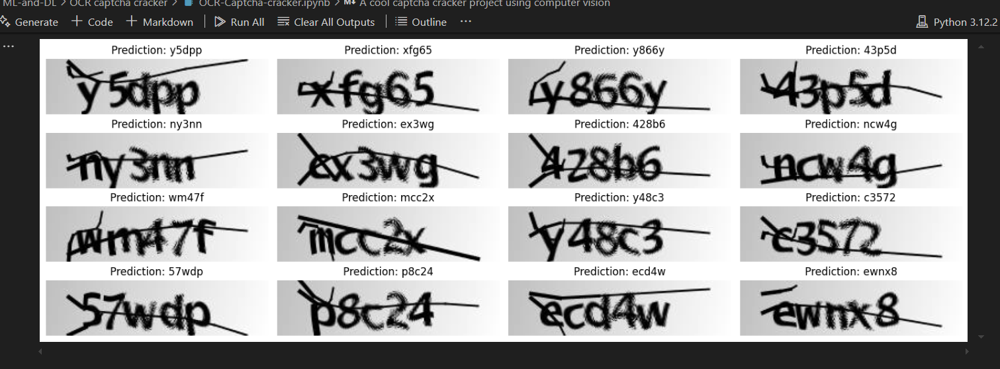

# OCR Captcha Cracker



## Overview
This project aims to develop an Optical Character Recognition (OCR) system to crack CAPTCHA images. The system leverages machine learning and deep learning techniques to accurately recognize and decode text from CAPTCHA images.

## Features
- **Image Preprocessing**: Techniques to enhance image quality and readability.
- **Model Training**: Training deep learning models to recognize CAPTCHA text.
- **Prediction**: Decoding text from CAPTCHA images using trained models.
- **Evaluation**: Assessing the accuracy and performance of the OCR system.

The model is built with TensorFlow and Keras, featuring the following layers and techniques:

1. **Convolutional Layers**: Extract spatial features.
2. **Bidirectional LSTM Layers**: Capture sequential dependencies and improve character recognition in sequences.
3. **CTC Loss Layer**: Manages sequence-to-sequence decoding with varying input lengths.

### Model Summary

```
Input Layer -> Conv2D -> MaxPooling2D -> Conv2D -> MaxPooling2D-> Reshape -> Dense -> Bidirectional LSTM -> Dense (Softmax)-> CTC Loss 
```


## Contributing
Contributions are welcome! Please open an issue or submit a pull request for any improvements or bug fixes.

